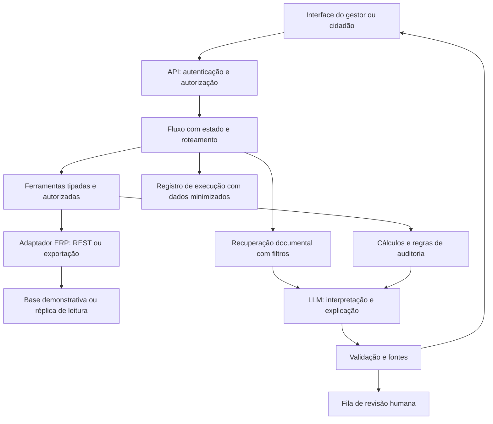

# Pesquisa e recomendação de projeto para a vaga da Equiplano

Consulta: **05/10/2026**. Base: perguntas do EQUIP.md, vaga oficial, páginas da Equiplano, documentação Oracle e dos frameworks, e materiais oficiais do CLP. Este é um estudo e uma proposta de portfólio; não representa parceria com a empresa, integração já realizada ou produto implementado.

## 1. Recomendação

Construir o **GovERP AI Lab: assistente municipal com relatórios verificáveis, auditoria de despesas e conhecimento documentado**. Uma aplicação com base compartilhada e quatro módulos, entregue em etapas. Começar por relatórios e auditoria financeira em ERP demonstrativo, acrescentar atendimento informativo e apoio fiscal com RAG, e finalizar com diagnóstico de competitividade.

O primeiro fluxo completo deve ser: **pergunta do gestor → consulta autorizada → cálculo reproduzível → alerta explicável → revisão humana → relatório com evidências**. Isso torna visível a ligação entre IA, dados, segurança e decisão administrativa.

Para um piloto comercial, atendimento informativo público pode ser a entrada mais simples. Para este portfólio, relatórios + auditoria demonstram mais diretamente integração com ERP e rastreabilidade. São decisões de prioridade deste estudo, não prioridades anunciadas pela empresa.

## 3. Como atender às responsabilidades principais

A vaga concentra os quatro produtos citados no EQUIP.md e exige agentes, integração ERP, RAG/memória/orquestração, qualidade/rastreabilidade e colaboração com produto/P&D. Python e frameworks de agentes aparecem nos requisitos; MCP e integração com Java/legados são diferenciais. [Vaga oficial](https://equiplano.gupy.io/job/eyJqb2JJZCI6MTI2MTcxMzksInNvdXJjZSI6Imd1cHlfcG9ydGFsIn0=?jobBoardSource=gupy_portal).

| Responsabilidade | Entrega demonstrável | Evidência para entrevista |
|---|---|---|
| Arquitetar agentes e pipelines de LLM | Fluxo de roteamento, ferramentas tipadas, validação e resposta fundamentada | Diagrama, registro de uma execução completa e avaliação do fluxo |
| Integrar IA ao ERP | Adaptador REST/CSV para entidades financeiras; consultas somente leitura | Contrato de dados, testes de integração e comparação com relatório de referência |
| RAG, memória e orquestração | Recuperação por município/vigência, histórico por usuário e caso, fluxo com estado persistente | Casos de documentos alterados, isolamento e retomada após falha |
| Qualidade, segurança e rastreabilidade | Controle de acesso no backend, corpus versionado, auditoria e avaliação | Testes adversariais, fontes válidas, resultados e limitações publicadas |
| Produto e P&D | Personas, jornadas, critérios de aceite e decisões arquiteturais | Ligação explícita entre problema, implementação, métrica e feedback |

Documentar colaboração como **validação planejada** enquanto não houver usuários reais. Uma persona escrita e uma demo não equivalem a pesquisa com servidores.

## 4. Soluções concretas: os quatro módulos

### 4.1 Relatórios por linguagem natural — primeira entrega

Pergunta: “Compare as despesas pagas de cada secretaria neste trimestre com o anterior e mostre a memória de cálculo”.

Dados: município/órgão, fornecedor, contrato, empenho, liquidação, pagamento, receita, classificação e datas. O dicionário distingue valores empenhados, liquidados e pagos, cancelamentos e restos a pagar; não somar essas fases como despesas independentes.

Fluxo: identificar indicador e período, pedir esclarecimento quando necessário, consultar função autorizada e gerar tabela/gráfico. SQL e código calculam; o LLM explica. Começar com catálogo de consultas fechadas. SQL gerado livremente é uma expansão, condicionada a avaliação, parser, permissões efetivas, limite de tempo/linhas e bloqueio de funções perigosas; aceitar SELECT não basta para assegurar proteção.

Cada resposta mostra conceito, filtros, data de atualização, fonte e identificador da consulta. Se a base estiver incompleta, não concluir que a despesa foi zero.

**Valor:** reduzir extração manual e permitir exploração do BI. **Avaliação:** resultado numérico idêntico ao cálculo de referência, interpretação correta do período, abstenção quando faltar dado e bloqueio de consultas sem permissão.

### 4.2 Controle interno — segunda entrega

Pergunta: “Quais pagamentos deste mês precisam de revisão e por quê?”.

Regras iniciais: possível duplicidade por documento/fornecedor/valor, divergência entre fases financeiras e documento, e sequência temporal inconsistente. Considerar parcelamentos, estornos, complementações e correções antes de alertar. Sem campos suficientes, marcar a regra como não avaliável.

Regras determinísticas geram achados; o LLM organiza sua explicação. Cada ocorrência contém registros de origem, regra e versão, recorte temporal, evidências e situação de revisão. O revisor confirma, rejeita ou solicita informação. Nenhum alerta altera pagamento ou gera acusação automática.

**Valor:** ampliar cobertura e organizar a revisão. **Avaliação:** precisão/recall em conjunto rotulado, falsos positivos, reprodução do achado e tempo para revisar. “Possível duplicidade” não significa fraude, economia efetiva ou dívida recuperada.

### 4.3 Atendimento autônomo informativo

Duas jornadas separadas: cidadão buscando serviço municipal; servidor buscando orientação de uso do sistema. Começar com catálogo público de serviços e manuais demonstrativos próprios, identificados como tal; não inventar documentação da Equiplano.

Exemplo: “Como abro uma solicitação de iluminação pública?”. Recuperar requisitos, canal e instruções do município certo, citar a fonte e encaminhar quando faltar informação. Consultar protocolo ou débito exige autenticação e autorização específica. Na primeira versão, abrir chamado significa preparar um rascunho ou simular o envio, com indicação clara.

**Valor:** reduzir dúvidas repetitivas para empresa e prefeitura; melhorar acesso do cidadão. **Avaliação:** respostas sustentadas, encaminhamento correto, resolução confirmada e reabertura. Volume de mensagens não mede resolução.

### 4.4 Apoio fiscal com legislação

Limitar a primeira versão a um assunto e uma jurisdição, por exemplo procedimentos de ISS. Ingerir legislação em fonte oficial e guardar município, competência, artigo, publicação, vigência, alterações/revogações, URL e hash. Se usar normas fictícias para testar temporalidade, rotulá-las e separá-las do corpus real.

Exemplo: “Qual dispositivo fundamenta este procedimento na data do fato?”. RAG recupera o texto relevante; a resposta aponta o artigo, informa limites e entrega uma minuta para revisão. Vigência deve vir de metadados verificados; o modelo não decide sozinho qual texto está em vigor. Regras de cálculo ficam em código aprovado, com validação especializada.

**Valor:** localizar fundamento e padronizar orientação. **Avaliação:** artigo/jurisdição/data corretos, ausência de referências inventadas, abstenção e comparação por especialista. Começar por pesquisa e explicação; atos fiscais e decisões tributárias exigem outro nível de validação.

## 6. Arquitetura proposta

### Escolhas iniciais

- **Backend:** Python/FastAPI; API REST com contratos explícitos e validação de entradas.
- **Dados:** PostgreSQL para ERP demonstrativo, casos, sessões e registros; pgvector e busca textual para documentos. Um banco inicial evita serviços desnecessários.
- **Orquestração:** LangGraph como opção principal, pois combina etapas determinísticas e agentivas, estado persistente e revisão humana, e está nominalmente na vaga. Começar com um fluxo e poucas ferramentas; separar especialistas quando houver diferenças reais de instrução, acesso ou responsabilidade. [Documentação oficial](https://docs.langchain.com/oss/python/langgraph/overview).
- **Frontend:** React/TypeScript, com conversa, tabela, fontes e fila de revisão. Gráficos e resultados devem poder ser verificados sem depender da explicação do modelo.
- **Modelo:** avaliar Qwen3-4B local como candidato inicial, sem tratá-lo como o mais recente ou melhor. A model card informa licença Apache 2.0 e uso com ferramentas. Qualidade em português fiscal, precisão das ferramentas e latência precisam ser medidas no hardware disponível. [Model card](https://huggingface.co/Qwen/Qwen3-4B).
- **Embeddings:** avaliar multilingual-e5-small, com licença MIT, suporte a português e vetores de 384 dimensões; respeitar prefixos query/passage e limite de entrada indicado. Comparar recuperação com busca textual antes de adicionar reranker. [Model card](https://huggingface.co/intfloat/multilingual-e5-small).
- **Execução:** Docker Compose, dados de exemplo reproduzíveis e configuração local. LLM pequeno/quantizado pode viabilizar uma demo, mas tamanho do modelo não assegura desempenho nem memória suficiente.

### RAG, memória e ferramentas

RAG: ingestão de fonte permitida → preservação do original/hash → segmentação por unidade documental/artigo → índice → filtro de município, perfil e data → recuperação textual/vetorial → resposta citada ou abstenção. Um documento recuperado é dado não confiável; suas instruções não podem mudar permissões.

Memória: histórico curto por usuário/município/caso, estado da tarefa e preferências explicitamente salvas, com retenção e exclusão definidas. Leis e números financeiros continuam nas fontes; conversa passada não vira fato oficial. Isolar também cache, arquivos exportados, índice e checkpoints.

Ferramentas iniciais ilustrativas: consultar despesas por período; listar evidências de pagamento; executar regra de auditoria; recuperar norma; consultar indicador público. O município vem da sessão autenticada. Não aceitar um município fornecido pelo LLM como autorização. MCP pode expor esse mesmo conjunto controlado como diferencial, depois de a API estar estável.

### Segurança e observabilidade

Aplicar privilégios mínimos no banco e na aplicação, filtros/RLS quando adequados, exportação autorizada, limites de uso e registros com acesso controlado. Testar dois municípios e dois usuários para demonstrar segregação. Uma instrução no prompt não substitui isso.

Guardar modelo/prompt/corpus/regra e suas versões, ferramentas chamadas, fontes e IDs de registros, latência, uso e revisão; evitar conteúdo pessoal em telemetria. Histórico detalhado de caso, se necessário, fica separado e protegido. O guia da ANPD trata finalidades, bases legais e compartilhamento no setor público; infraestrutura em nuvem, isoladamente, não comprova conformidade. [Guia oficial](https://www.gov.br/anpd/pt-br/centrais-de-conteudo/materiais-educativos-e-publicacoes/guia-poder-publico-anpd-versao-final.pdf).

Se houver experimento com Agents SDK, a exportação padrão de traces e captura de conteúdo sensível precisam ser configuradas explicitamente para o contexto municipal. A documentação informa tracing habilitado e conteúdo sensível capturado por padrão; não adicionar exporter local mantendo envio remoto inadvertido. [Tracing](https://openai.github.io/openai-agents-python/tracing/).

## 9. Dados e plano de entrega

**Sem acesso empresarial:** gerar ERP demonstrativo sintético, com municípios fictícios para segurança, regras financeiras explícitas e casos normais/anômalos rotulados. Separadamente, usar município real como recorte de dados públicos. Não misturar registros fictícios e oficiais em uma mesma série.

**Fontes:** dados contábeis públicos do Siconfi, contratações do PNCP, IBGE e planilha oficial CLP. Siconfi fornece informações contábeis/fiscais, mas não substitui um ERP transacional completo. PNCP não prova execução/pagamento. Guardar URL, data, esquema, licença/condições e hash dos snapshots; testar disponibilidade, paginação e histórico. [APIs Tesouro](https://www.gov.br/tesouronacional/pt-br/central-de-conteudo/apis), [PNCP](https://www.gov.br/pncp/pt-br/pncp/perguntas-e-respostas/), [consultas PNCP](https://pncp.gov.br/api/consulta/swagger-ui/index.html).

### Validação e material de portfólio

Testar cálculos, conciliação, autorização e integração; avaliar o fluxo real do modelo com perguntas e referência. Cobrir prompt injection, documento revogado, pergunta sem fonte, base incompleta, ERP indisponível, duplicidade legítima, vazamento entre municípios e exportação indevida.

Publicar conjunto de casos, versão do modelo/corpus, critério de correção, quantidade de exemplos, erros e latência no hardware utilizado. Metas iniciais são critérios de aceite, não resultados: igualdade numérica dos relatórios definidos, nenhuma operação de escrita disponível ao modelo e nenhum vazamento nos casos de segurança executados. Zero falhas em uma amostra não prova segurança universal.

CI deve conferir qualidade e testes determinísticos sem chamadas pagas obrigatórias. Avaliações com modelo têm ambiente, consumo e resultados próprios. Docker, saúde da API, backup/restauração e caminhos de erro precisam estar demonstrados; não usar apenas uma captura de tela como prova end-to-end.

README: problema, domínio, execução, diagrama, dados, resultados e limites. Acrescentar decisões sobre leitura do ERP, fonte de verdade, memória, revisão humana e OCI. Vídeo sugerido: pedir relatório → conferir cálculo → revisar alerta → perguntar fundamento → mostrar fonte → tentar acesso a outro município e mostrar bloqueio.
